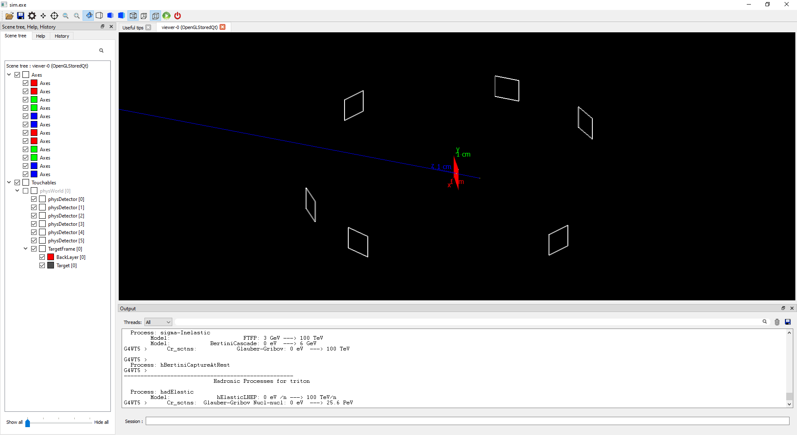

# Proton + Al-N target simulation v1.0

## ⭐ About this project
This project was implemented to simulate a proton experiment at HUS. The 1.MeV proton beam boombed a Al-N target along z axis. There are 6 Si detectors placed around target to record parcticles emmited from interaction.

## 🔧 Requirements
* Ubuntu 20.04
* Geant4.10.07
* Root data analysis framework

## 🏃‍♂️ How to run
- Create a new folder to build example. For example, I created "bld" folder.
    ```c++
    cd HUS_AlN-Target
    mkdir bld
    cd bld
    ```
- Build
    ```c++
    cmake ..
    make -j4
    ```
- Run example in interactive mode
    ```c++
    ./sim
    ```
- Run example in batch mode
    ```c++
    ./sim run.mac
    ```

## 📒 Release Note
- **12/10/2023**: Release V1.0 for Geant4.11.1.2
  * **Geometry**: a Target Al-N, and 6 Si detectors
    
  * **Physics**: using `G4VModularPhysicsList()` and template from example ***extent/hadronic/Hadr01***. You can choose a physics by using command:

    ```
    /testhadr/Physics physic_name
    ```
  * **Primary source**: a 1 MeV proton source have a disk shape with 0.5 mm of radius placed at -1 cm in z axis.
  * **Scoring**: the deposition energy for each step is stored for each event and accumulates for a run. The results are written to the file in ROOT format. User can use following command to change the name of ROOT file:

    ```
    /output/FileName out_QBBC.root
    ```
- **17/10/2023**: Release V1.1 for Geant4.11.1.2
--- 
## 🚀 About Me
**Bùi Tiến Hưng** 

*Master of Science in Nuclear Engineering.*

1. Nuclear Engineering Lab, Hanoi University of Science and Technology (HUST).

2. Department of Planning and R&D Management, Vietnam Atomic Energy Institute (VINATOM).

**Interestet Fields:**

* Medical physics, 
* Monte-Carlo simulation, 
* Machine learning.
 
**Contact:**
    * Phone: +84 352348985
    * Email: buitienhung@vinatom.gov.vn, hungbt1908@gmail.com
    * Adress: Vietnam Atomic Energy Institute, No 59 Ly Thuong Kiet street, Hoan Kiem district, Hanoi, Vietnam. 